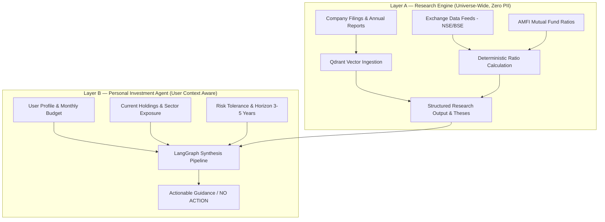

# System Architecture

## 1. Architectural Philosophy: Two-Layer Separation

The system decouples the market research engine from personal portfolio management.



### Layer A: Research Engine
* Researches stocks, ETFs, mutual funds, IPOs, and corporate announcements independently of any user.
* Ingests official regulatory documents from NSE, BSE, SEBI, and AMFI into PostgreSQL (structured metrics) and Qdrant (unstructured filings, transcripts, presentations).
* Produces structured research data, factual claims, and verifiable investment theses.
* **Never contains user profiles, budgets, or personal financial data.**

### Layer B: Personal Investment Agent
* Consumes candidate theses from Layer A.
* Applies user constraints: monthly budget, risk profile, existing company/sector concentration limits, and investment goals.
* Evaluates portfolio impact, tests thesis break conditions, and executes verification gates.
* Emits recommendations (`OPPORTUNITY` with specific SIP/staggered allocation or `NO_ACTION`).

## 2. Core Modules

```text
src/investment_agent/
├── main.py              # FastAPI application entrypoint
├── config/              # Pydantic Settings and environment configuration
├── llm/                 # Multi-provider LLM factory and tier routing
├── graph/               # LangGraph state, nodes, edges, and workflow
├── db/                  # SQLAlchemy models and async session management
├── portfolio/           # Pure deterministic financial math (CAGR, P/E, weights, SIP)
├── research/            # Evidence tracking, source provenance, and verification
└── evaluation/          # Reality monitoring, immutable logs, error taxonomy
```
